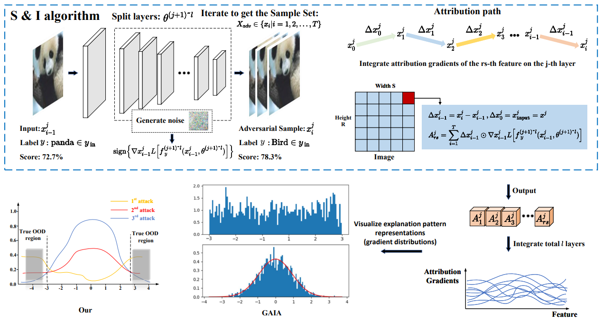

# Splitting & Integrating: Out-of-Distribution Detection via Adversarial Gradient Attribution

This repository contains the official implementation of the paper:

**Splitting & Integrating: Out-of-Distribution Detection via Adversarial Gradient Attribution**  
*Anonymous Authors*  
Under review as a conference paper at ICML 2025.

## Introduction

Out-of-distribution (OOD) detection is crucial for enhancing the robustness and security of deep learning models in unknown and dynamic environments. Our approach, **Splitting & Integrating (S&I)**, introduces a novel OOD detection method based on layer splitting and gradient integration via adversarial gradient attribution. By iteratively updating adversarial examples and integrating attribution gradients across layers, S&I significantly improves OOD detection performance compared to traditional methods.

Key contributions:
- Introduces adversarial examples for improving gradient-based OOD detection.
- Proposes layer splitting and gradient integration to capture true explanation patterns.
- Achieves state-of-the-art performance on benchmarks like CIFAR100 and ImageNet.


## Running the Experiments

To run the experiments on CIFAR100 and ImageNet benchmarks, use the following commands:

```bash
python run.py
```

## Results

Our method achieves the following results:

- **CIFAR100 (ResNet34)**: Average FPR95 of **29.05%** and AUROC of **94.93%**.
- **ImageNet (BiT-S)**: Average FPR95 of **37.31%** and AUROC of **91.84%**.

For a detailed breakdown of results, refer to the paper.

## Algorithm Overview

The core of our proposed method, **S&I**, is visualized in the flowchart below (Figure 2 in the paper). The flowchart illustrates the process of detecting out-of-distribution (OOD) samples by analyzing adversarial gradient attribution. Our method consists of two key steps:

1. **Layer Splitting**: The neural network's intermediate layers are progressively split, and adversarial examples are updated layer by layer. This step helps capture the sensitivity of intermediate features to the input, which can vary across layers.
  
2. **Adversarial Gradient Integration**: After each layer is split, the gradients are integrated along the attribution path from the adversarial example to the actual input. This integration smooths out gradient fluctuations and allows the method to derive more accurate explanation patterns for both in-distribution (ID) and OOD samples.

The flowchart demonstrates how our approach combines these two techniques to gradually refine the explanation patterns and improve the reliability of OOD detection.

<p align="center">
  
</p>

The S&I method is particularly effective at isolating OOD samples by ensuring that the non-zero gradient behavior is progressively better distinguished, even when random noise impacts ID samples in high-dimensional spaces.

## Citation

If you find this repository useful in your research, please cite our work:
```
coming soon
```
